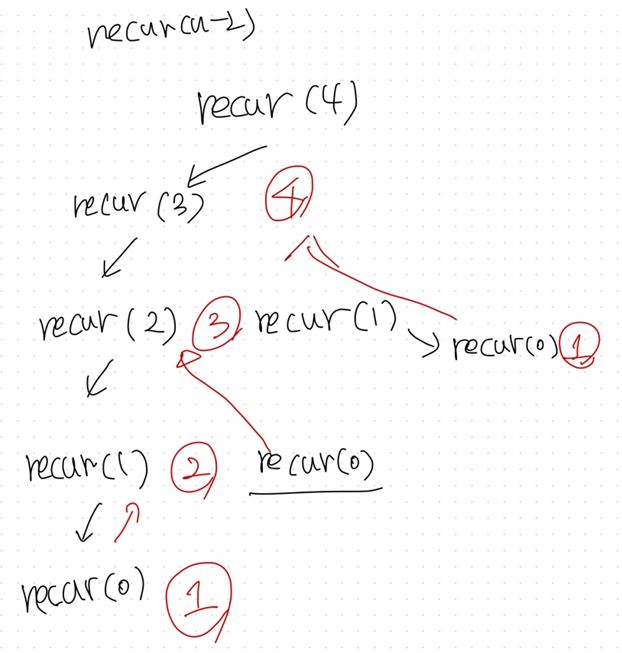
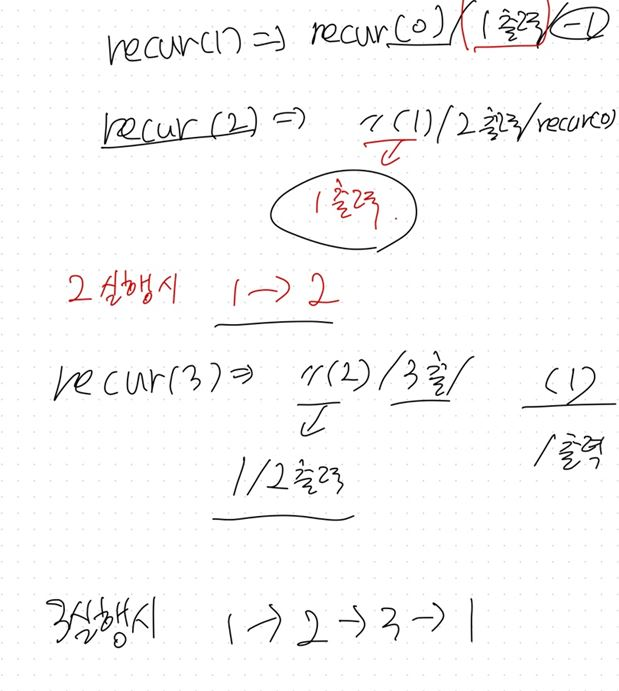
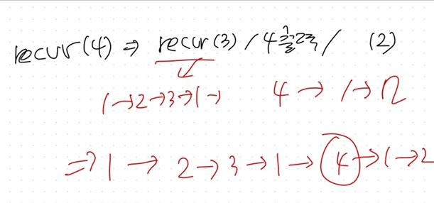

# Recursion (재귀, 순환)

- 재귀란? 
  
- (컴퓨터 과학에서) 자신을 정의할 때 자기 자신을 재참조 하는 방법을 뜻함, 재귀호출
  
- 재귀는 똑같은 함수를 다시 호출한다고 생각하면 쉽다. 

- 자기와 똑같이 생긴 함수를 또 호출하는 것

- 예시1) 

  ```c
  int func(int n){
  	if(n==0)
          return 0;
      else
          return n+func(n-1);
  }
  ```

  

- 또한 재귀함수는 무한루프에 빠지기 쉽다. 빠지지 않도록 하려면 다음과 같은 성질을 가져야 한다.
  - Base case : 적어도 하나의 재귀에 다시 빠지지 않는 경우가 존재해야 한다. (예시 : n이 0일 경우/ 끝에 도달했을 경우/ 다시 검색할 수 없을 경우 등등)
  - Recursive case : 재귀를 반복하다 보면 결국 다시 base case로 수렴해야 한다. (언젠가는 끝내야 한다.)

- 모든 재귀함수는 반복문으로 변경 가능하다. => 모든 반복문 또한 재귀함수로 표현 가능하다. (시간이 너무 오래걸리거나 무한루프같은 이유로 구현이 어려워서 간단하게 쓰는 것이 중요하다고 생각,,)

- 재귀함수를 설계할 때의 tip : 암시적(implicit) 매개변수를 명시적 (explicit) 매개변수로 쓰면 알아보기 쉽다.

  예시2) 순차 탐색

  ```java
  int search (int [] data, int n, int target){
      for (int i = 0; i<n; i++)
          if(data[i]==target)
              return i;
      return -1
  }
  ```

  이렇게 int n 처럼 암시적으로 매개변수를 쓰게 되면,  순차적으로 검색을 할 때 data[0]~data[n-1] 사이에서 검색하게 되는데, 검색 구간의  시작 인덱스 0을 생략하게 된다.

  -> 암시적 매개 변수를 사용하게 됨 (이 부분 이해 잘 안감,,,)

  

  매개변수를 명시화 해서 사용하게 되면 다음과 같다.

  예시3) 매개변수 명시화를 사용하여 구현한 순차 탐색

  ```java
  int search(int[] data, int begin, int end, int target){
      if(begin>end)
          return -1;
      else if(target == data[begin])
          return begin;
      else
          return search(data, begin+1, end, target);
  }
  ```

  이렇게 begin, end를 이용하여 구현하게 되면 재귀함수를 좀 더 쉽게 이해하고 구현할 수 있다. begin과 end가 달라졌을때, 달라진 값으로 함수를 호출하게 되면 그 함수내에서는 그 값이 begin과 end가 되므로 다른 값은 신경쓰지 않아도 되기 때문에 편해진다. 

  

#### 재귀 분석

- 재귀 분석은 다음과 같은 코드를 분석한다.

  ```java
  void recur(int n){
  	if(n>0){
          recur(n-1);
      	System.out.println(n);
      	recur(n-2);
      }
  }
  ```

  n이 4일때, 하향식 분석과 상향식 분석이 있다. 

- 하향식 분석 : 




꼭대기에서 계단처럼 내려와서 다시 돌아가는 방법인데, 같은 함수를 여러번 호출 할 수 있으므로 (사진에서는 recur(0)) 마냥 효율적이진 않다. 


- 상향식 분석 : 

  




(개인적으로 상향식이 좀 더 편했음,,,)

1에서 부터 n까지 올라가는 방법이다.


##### 재귀함수에서 재귀 없애기

이게 뭔소리여?? 싶을 수도 있는데, 알고리즘 문제에서 가끔 쓰는 것 같다. 스택과 큐를 이용하여 재귀를 사용하지 않고 검색을 하는 문제에서 본 것 같다. (아닐 가능성 1000%)

```java
void recur(int n){
	if(n>0){
        recur(n-1);
    	System.out.println(n);
    	recur(n-2);
    }
}
```

위 예제 기준으로 재귀를 없애기 위해서는

1. n-2 없애기 호출하는 부분 없애기
2. n-1 없애기 호출하는 부분 없애기

를 해야한다.

* 1번을 제일 먼저 해결하면, 함수를 반복문으로 수정한 뒤 n-2를 n값으로 저장하면 된다.

* 2번을 해결하기 위해서는 n의 값을 n-1로 업데이트 하고 함수의 시작지점으로 돌아가야한다. 하지만 중간에 원래 함수를 호출한 n값을 출력해야 하므로 n 값을 잠깐 저장해야 한다. 

* 그 다음에 저장했던 n값을 꺼내서 호출한다.

  이렇게 하기 위해서는 n의 값을 잠시 저쟝해야 한다. 따라서 스택을 이용하여 값을 잠시 저장했다가 사용한다.

```java
void recur(int n){
    Stack<Integer> stack = new Stack<>();
	while(true){
        if(n>0){
            stack.push(n);
            n = n-1;
            continue;
        }
        if(!stack.isEmpty()){	//스택이 비어있지 않다면
            n = stack.pop();
            System.out.println(n);
            n = n-2;
            continue;
        }
        break;
    }
}
```

앞의 예제와 똑같이 n이 4였다면!

- 4를 push
- n = 3이 된다.
- continue를 통해서 while문 처음으로 돌아간다. 
- 3을 push
- n = 2이 된다.
- continue를 통해서 while문 처음으로 돌아간다. 
- 2를 push
- n = 1이 된다.
- continue를 통해서 while문 처음으로 돌아간다. 
- 1을 push
- n = 0이 된다.
- continue를 통해서 while문 처음으로 돌아간다. 
- 여기서 0이 되었기 때문에 push를 하지 않고 pop을 하러간다.
- 이때 제일 위에 있는 1을 pop하여 1을 출력하고 n은 -1이 된다.
- continue를 통해서 while문 처음으로 돌아간다.
- 이때도 -1이 되었으므로 다시 pop을 한다. 
- (반복)

이렇게 하면 트리나 그래프도 스택과 pop을 이용하여 반복적으로 함수를 호출하지 않고 처리할 수 있다.  (햐향식 접근)
